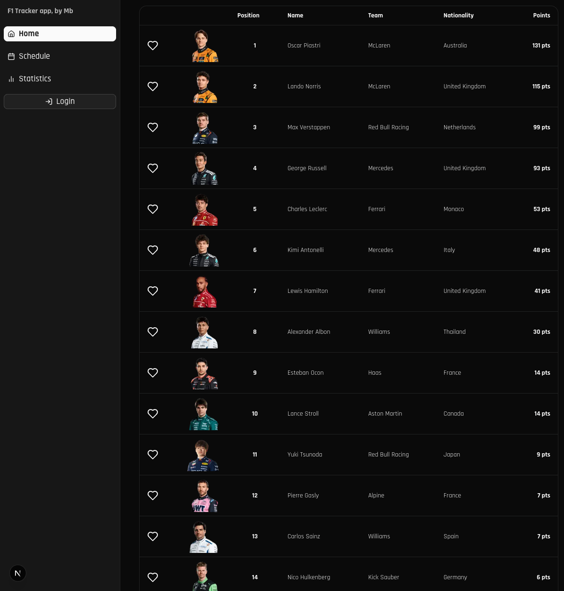
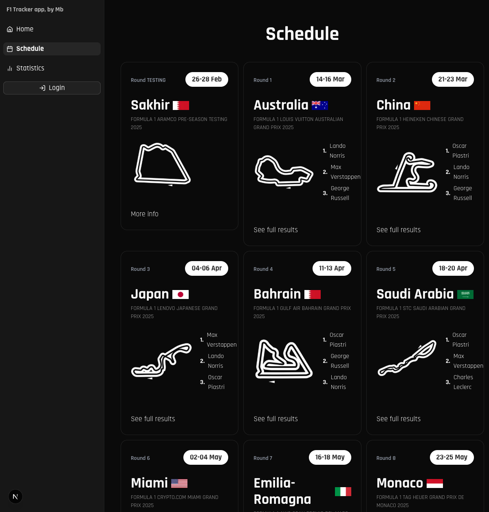
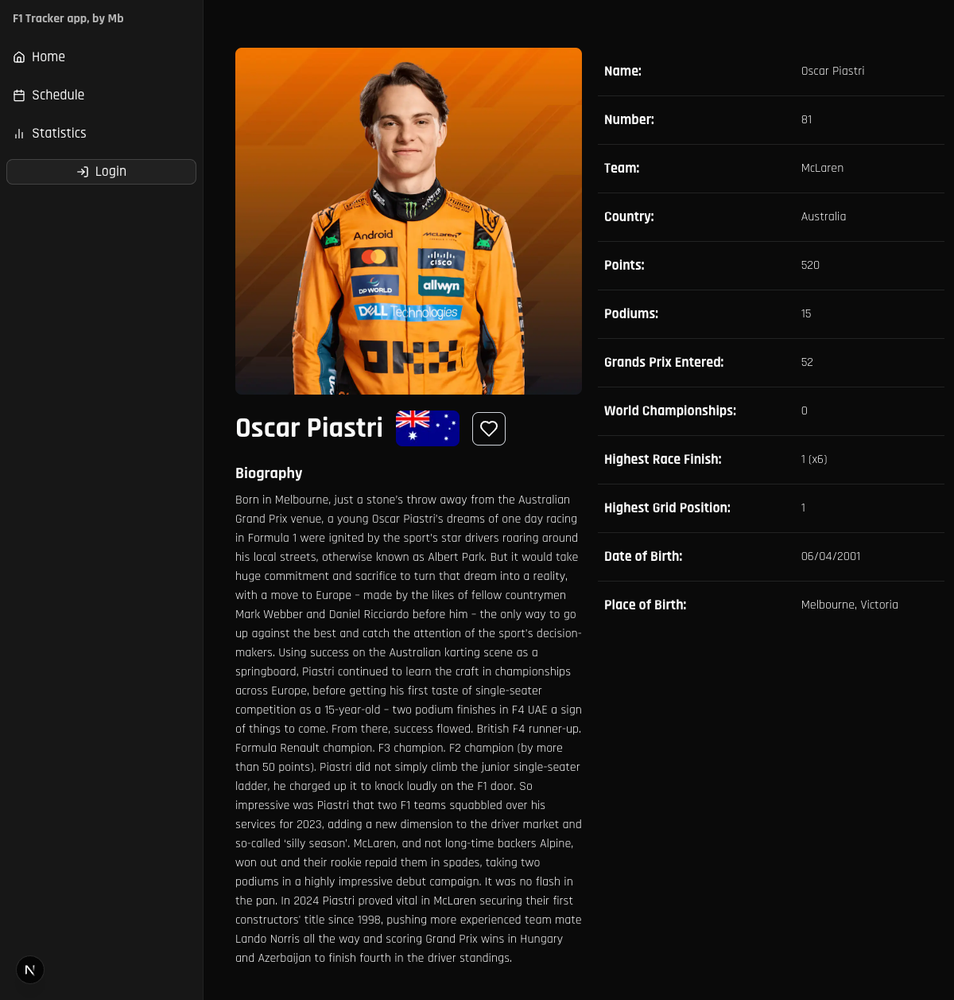
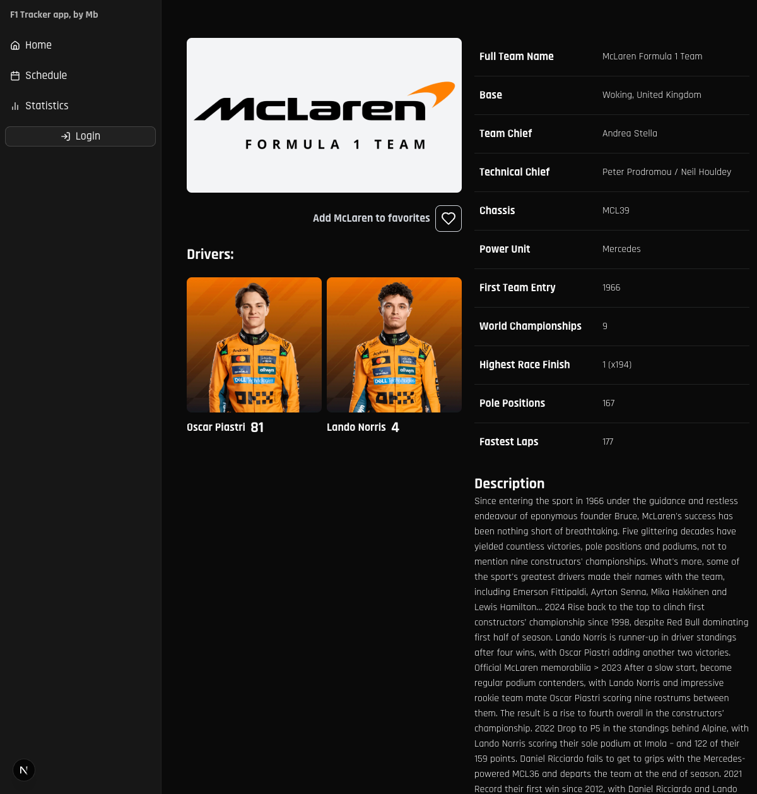

# F1 Clone Project By: Mb 🏎️

## Table of Contents

- [Description](#description)
- [Technologies](#technologies)
- [How to Use](#how-to-use)
  - [Prerequisites](#prerequisites)
  - [Installation](#installation)
  - [Running the Project](#running-the-project)
- [API Endpoints](#api-endpoints)
- [Pages](#pages)
- [Server Actions](#server-actions)
- [View Transitions](#view-transitions)
- [Web Scraping](#web-scraping)
- [Authentication](#authentication)
- [Disclaimer](#disclaimer)
- [Project Status](#project-status)
- [Screenshots](#screenshots)

## Description

This project is a Formula 1 website clone, created for educational and practice purposes. The main goal is to improve web development skills and better understand modern frontend technologies.

## Technologies

- React.js
- Next.js
- TypeScript
- Tailwind CSS
- Playwright (Web Scraping)
- Next.js API Routes
- Authentication System (Clerk)

## How to Use

### Prerequisites

- Node.js (version 18.x or higher)
- npm, yarn, or Bun
- Git

### Installation

1. Clone the repository:

   ```bash
   git clone https://github.com/yourusername/f1-clone.git
   cd f1-clone
   ```

2. Install dependencies:

   ```bash
   # Using npm
   npm install

   # Using yarn
   yarn install

   # Using Bun
   bun install
   ```

3. Set up environment variables:
   - Create a `.env` file in the root directory
   - Add your Clerk authentication keys:
     ```
     NEXT_PUBLIC_CLERK_PUBLISHABLE_KEY=your_publishable_key
     CLERK_SECRET_KEY=your_secret_key
     ```

### Running the Project

1. Start the development server:

   ```bash
   # Using npm
   npm run dev

   # Using yarn
   yarn dev

   # Using Bun
   bun dev
   ```

2. Open your browser and navigate to:
   ```
   http://localhost:3000
   ```

## Web Scraping

The project uses web scraping techniques to obtain updated Formula 1 data. We use the following technologies:

- **Playwright**: For browser automation and data extraction
- **Chromium**: As headless browser for scraping
- **Next.js API Routes**: To create endpoints that serve the scraped data

The information is obtained ethically and respecting the terms of use and robots.txt of the official Formula 1 website.

# API Endpoints

### Schedule API Endpoints

#### GET /api/schedule

- Returns the complete F1 2025 season calendar
- Includes detailed information for each race:
  - Grand Prix name
  - Circuit
  - Date and month
  - Round number
  - Country flag and circuit images
  - Podium results for completed races (top 3)
- Example: `http://localhost:3000/api/schedule`

#### GET /api/schedule/[id]

- Returns detailed information about a specific race by ID
- Includes circuit details, schedule, and results if available
- Example: `http://localhost:3000/api/schedule/australia` (retrieves information for Australia's race)

#### GET /api/schedule/results

- Returns race results for a specific Grand Prix
- Parameters (all required):
  - `season`: Year of the race (e.g., 2024, 2025) - defaults to current year if not provided
  - `sessionId`: The session identifier for the race
  - `circuitId`: The circuit identifier for the race
- Shows detailed race results including:
  - Position
  - Driver number
  - Driver name
  - Team/car
  - Laps completed
  - Time/retirement status
  - Points earned
- Example: `http://localhost:3000/api/schedule/results?season=2025&sessionId=1089&circuitId=bahrain`

#### GET /api/schedule/next-round

- Returns detailed information about the next race
- Includes:
  - Basic Grand Prix information
  - Qualifying and race schedules
  - Circuit and country flag images
- Example: `http://localhost:3000/api/schedule/next-round`

### Drivers API Endpoints

#### GET /api/drivers

- Returns the complete list of drivers for the current season
- Information per driver:
  - First and last name
  - Championship position
  - Points
  - Team
  - Country
  - Driver image
- Example: `http://localhost:3000/api/drivers`

#### GET /api/drivers/[id]

- Returns detailed information about a specific driver by ID
- Includes career statistics, current team, and biographical information
- Example: `http://localhost:3000/api/drivers/hamilton` (retrieves information for Lewis Hamilton)

#### GET /api/drivers/statistics

- Returns detailed statistics for all drivers in the specified season
- Parameters:
  - `season`: Year for the statistics data (e.g., 2024, 2025) - defaults to current year if not provided
- Information per driver:
  - Position in the championship
  - Driver details (name, last name, abbreviated code, ID)
  - Country
  - Team information (name, ID)
  - Points earned
- Example: `http://localhost:3000/api/drivers/statistics?season=2025`

### Teams API Endpoints

#### GET /api/teams

- Returns the complete list of F1 teams
- Information per team:
  - Team name
  - Constructor championship position
  - Points
  - Team logo
  - Current car image
- Example: `http://localhost:3000/api/teams`

#### GET /api/teams/[id]

- Returns detailed information about a specific team by ID
- Includes team history, current drivers, and car specifications
- Example: `http://localhost:3000/api/teams/mercedes` (retrieves information for Mercedes F1 team)

#### GET /api/teams/statistics

- Returns detailed statistics for all teams in the specified season
- Parameters:
  - `season`: Year for the statistics data (e.g., 2024, 2025) - defaults to current year if not provided
- Information per team:
  - Position in the championship
  - Team name
  - Points earned
  - Team ID
- Example: `http://localhost:3000/api/teams/statistics?season=2025`

# Pages

### Home Page (/)

- Landing page with featured content
- Displays next race countdown, latest news, and highlights
- Quick access to drivers' and teams' standings
- Components:
  - Race countdown timer
  - Position tables for drivers and teams
  - Featured content carousel

### Schedule Pages

#### Schedule Main Page (/schedule)

- Displays the complete F1 2025 season calendar
- Shows all race dates, circuits, and countries
- Race results available for completed races
- Components:
  - Schedule calendar
  - Circuit cards

#### Race Details Page (/schedule/[id])

- Detailed information about a specific race
- Shows circuit layout, race times, and results (if available)
- Includes historical data and track information

### Statistics Pages

#### Statistics Main Page (/statistics)

- Comprehensive view of current season statistics
- Driver and constructor standings
- Performance metrics and comparison tools

#### Drivers Statistics Page (/statistics/drivers)

- Detailed driver standings and performance metrics
- Comparison tools for driver performance
- Points progression throughout the season

#### Teams Statistics Page (/statistics/teams)

- Constructor championship standings
- Team performance metrics
- Points progression throughout the season

### History Page (/history)

- Archive of Formula 1 historical data
- Past champions, legendary drivers, and iconic moments
- Timeline of Formula 1 evolution

### Info Pages

#### Driver Info Page (/driver-info/[id])

- Detailed profile for individual drivers
- Career statistics, biography, and current season performance
- Media gallery and latest news
- Components:
  - Driver profile header
  - Statistics dashboard
  - Career timeline
  - Media gallery

#### Team Info Page (/team-info/[id])

- Comprehensive team profiles
- Technical specifications of current car
- Team history, achievements, and current driver lineup
- Components:
  - Team profile header
  - Car specifications
  - Driver cards
  - Team history timeline

## Server Actions

The project utilizes Next.js server actions for various functionalities:

### Favorites Management

**`addOrRemoveFromFavorites`**

- **Purpose**: Adds or removes drivers and teams from a user's favorites
- **Parameters**:
  - `type`: String indicating the type ('driver' or 'team')
  - `id`: String ID of the driver or team to add/remove
- **Returns**: Updated user metadata or error message
- **Authentication**: Requires logged-in user
- **Usage Example**:

  ```typescript
  // Direct function call example
  const result = await addOrRemoveFromFavorites('team', 'mercedes');

  // Real implementation example from AddRemoveFavorites component
  <TableCell>
    <AddRemoveFavorites className="border-none" type="driver" id={driver.id} />
  </TableCell>;

  // The AddRemoveFavorites component uses React's useOptimistic for immediate UI updates:
  const handleSubmit = async (id: string, type: string) => {
    changeOptimisticIsFavorite(!optimisticIsFavorite);
    startTransition(async () => {
      await addOrRemoveFromFavorites(type, id);
      await user?.reload();
    });
  };
  ```

## View Transitions

The project implements Next.js experimental View Transitions API for smooth, animated page transitions:

### Driver Image Transitions

- **Components**:
  - `PositionTable.tsx`: Creates a smooth transition when navigating from home to driver-info pages
  - `DriverImageSection.tsx`: Maintains image continuity when viewing driver profiles
  - `TeamDriversSection.tsx`: Animates transitions between team and driver pages

### Implementation

The project uses the unstable_ViewTransition component from React to wrap elements that should transition between pages:

```tsx
import { unstable_ViewTransition as ViewTransition } from 'react';

// Example usage
<ViewTransition name={`driver-image-${driver.id}`}>
  <Image src={driver.image} alt={driver.name} width={200} height={200} />
</ViewTransition>;
```

## Authentication

The project includes a complete authentication system with the following features:

- User registration (sign-up)
- User login (sign-in)
- Protected routes for authenticated users
- Custom layout for authentication pages

## Disclaimer

This project is for educational and practice purposes only. It is not affiliated in any way with Formula 1® or any of its trademarks. All F1-related logos, brands, and content are property of their respective owners.

## Project Status

🚧 Under development 🚧

## Screenshots

A continuación se muestran capturas de pantalla de las principales secciones de la aplicación:

### Página de Inicio (Home)


_Página principal mostrando la tabla de posiciones de pilotos, equipos y el próximo Gran Premio_

### Página de Calendario (Schedule)


_Calendario completo de la temporada 2025 de F1 con todos los Grandes Premios_

### Página de Estadísticas (Statistics)


_Estadísticas detalladas de pilotos con posiciones en el campeonato_

### Página de Información del Piloto


_Página de información detallada del piloto Oscar Piastri_

### Página de Información del Equipo


_Página de información detallada del equipo McLaren_

### Funcionalidad de Favoritos

La aplicación permite agregar pilotos y equipos a favoritos, como se muestra en los botones de corazón en las tablas y páginas de información.

> **Nota**: Las capturas de pantalla muestran datos ficticios para propósitos de demostración. La información real se actualiza mediante web scraping de fuentes oficiales.

---

> **Para agregar tus propias capturas**:
>
> 1. Guarda las capturas de pantalla en la carpeta `public/images/`
> 2. Actualiza las rutas en este README
